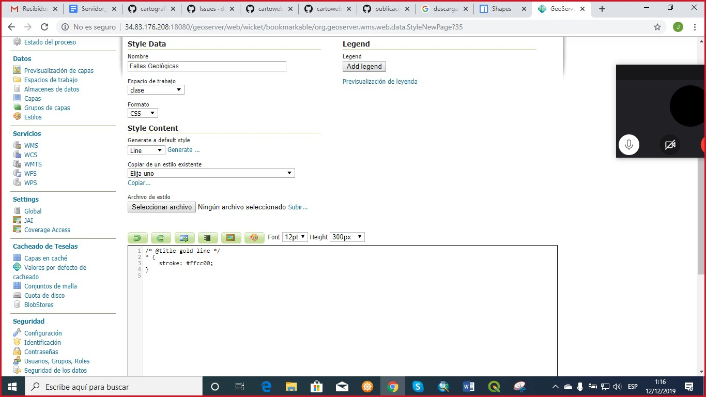

# TALLER 2
## Cuál es el problema a tratar?
Se desea conocer cuáles son los departamentos y municipios del territorio colombiano, sobre los cuales cruzan una o más fallas geológicas, quienes deben ser tenidas en cuenta dentro del Plan de Ordenamiento Territorial de los diferentes municipios, para la ejecución de diversos proyectos de infraestructura e ingeniería. 
## Por qué la publicación de servicios OGC puede ayudar a resolverlo?
Para la ejecución de diferentes proyectos de ingeniería sería bastante útil la publicación de servicios OGC, puesto que permite identificar aquellos municipios y/o departamentos que presentan fallas geológicas, así como también identificar su ubicación aproximada, contribuyendo en la toma de decisiones para la ejecución de dichos proyectos.
## Qué servicios propone para la solución de su problema? WMS? WMTS? WFS? Por qué? 
Para la solución del problema se considera más viable usar el servicio WFS, puesto que con éste es posible visualizar los atributos de las diferentes geometrías, extraerlos y editarlos. Mediante éste servicio va a ser posible determinar sobres cuáles municipios están atravesando las fallas geológicas y las características de dicha falla.
## Descripción de los datos seleccionados (Origen, descripción, características especiales, atributos, url para descarga)
Los datos seleccionados fueron los siguientes:
Departamentos:
Origen: Mapas en formato shp de ESRI.
Descripción: La capa de departamentos muestra la división político-administrativa del territorio colombiano, distribuida en sus 32 departamentos. 
Características especiales: La capa de departamentos presenta 11 atributos, de los cuales 8 cuentan con información.  
Atributos: id, geom, id_0, iso, name_0, id_1, name_1, type_1, engtype_1, nl_name_1, varname_1. 

URL: https://sites.google.com/site/seriescol/shapes
Municipios
Origen: Mapas en formato shp de ESRI.
Descripción: La capa de departamentos muestra la división político-administrativa del territorio colombiano, distribuida en sus 1065 municipios. 
Características especiales: La capa de departamentos presenta 13 atributos, de los cuales 11 cuentan con información.  
Atributos: id, geom, id_0, iso, name_0, id_1, name_1, id_2, name_2, type_2, engtype_2, nl_name_2, varname_2

URL: https://sites.google.com/site/seriescol/shapes
Fallas geológicas
Origen: SIG-OT (Sistema de Información Geográfica para el Ordenamiento Territorial).
Descripción: La capa de fallas geológicas muestra los registros de las fallas que se presentan a nivel nacional, mostrando un total de 6427 registros.
Características especiales: La capa de fallas geológicas presenta 11 atributos, de los cuales 10 cuentan con información.  
Atributos: id, geom, objectid, nom_fgeolo, actividad, tipo, tipo_fgeol, símbolo, sde_ sigot, shape_leng.

URL: http://sigotvg.igac.gov.co:8080/
## Descripción del procesamiento realizado con postgis (Incluir los sqls)
Para iniciar el procesamiento con postgis, inicialmente es necesario crear una conexión nueva mediante QGIS:

Posteriormente, se crea un nuevo servicio en PgAdmin 4, el cual lleva como nombre cartografiaweb y se hace la conexión adicionando los respectivos datos

Ahora bien, en QGIS, se procede con los procesos de administración de base de datos con las tres capas adicionadas, para ello se busca el servicio creado y se inicia con la importación de dichas capas (departamento, municipio y falla geológica), siguiendo los siguientes parámetros:

Una vez importados los datos, se procede a hacer la respectiva consulta de información, mediante el siguiente código, con el cual se crea la tabla u4_deptos_falla, buscando obtener todos los departamentos sobre los cuales cruzan fallas geológicas (por ello, se utiliza la función ST_Intersects):

## Descripción de la forma en que creó la simbología (incluir los sld's y css)
Una vez obtenida la capa de información, se procede con la importación de las capas en geoserver con la opción agregar nuevo recurso, como se muestra a continuación:

Una vez cargadas, se selecciona la opción publicación, se configura el encuadre y se guarda la versión:

A modo de verificación, se previsualiza la capa cargada con la opción OpenLayers

Este proceso se repite con las demás capas de información. Luego, una vez cargadas las fuentes de información se procede con la creación del nuevo grupo de mapas, como se muestra a continuación:

Capas adicionadas

Generación de límites:

Despues de crear el grupo de capaz, se configura la simbología mediante SLD y CSS, como se muestra a continuación: 
Se modifica la simbología de la capa departamentos y municipios en QGIS con la opción propiedades, la cual se guarda en formato SLD, como se muestra a continuación:

Ahora bien, se configura el estilo en geoserver, para lo cual se crea un nuevo estilo; se adiciona nombre, formato y el archivo SLD creado en QGIS y se sube, se valida y se aplica:

En la opción PUBLISHING se da clic en las dos opciones de la capa y posteriormente se previsualiza la capa con la metodología configurada por SDL 

LAYER PREVIEW

CCS
Para la configuración de color CCS, se aplica a las capas falla geológica y a la tabla creada en postgis, siguiendo los siguientes pasos:
En la pestaña estilo se hace la configuración como se hizo en SLD, sin embargo, en formato se elige CSS, se selecciona la geometria y se da la opción generar con el cual se obtiene un código. A dicho codigo aparece asociado un color el cual se puede modifcar:

Finalmente, se visualiza de la siguiente manera. El mismo procedimiento se repite para u4_deptos_falla

## Nombres de las tablas creadas en postgis
u4_deptos_falla 
## Nombres de las capas y estilos publicadas en geoserver.
Capa/Estilo
Deptos: sld_depto
	Municipios: sld_municipios
	Fallas: Fallas Geológicas (ccs)
	Deptos_falla: deptos_falla (ccs)

## Url de la previsualización del grupo de capas en Geoserver
http://34.83.176.208:18080/geoserver/clase/wms?service=WMS&version=1.1.0&request=GetMap&layers=clase%3AU4_Fallas%20Geologicas%20de%20Colombia&bbox=-81.8415298461914%2C-4.22842884063721%2C-66.71251817716609%2C15.9124755859375&width=576&height=768&srs=EPSG%3A4326&format=application/openlayers
##Pantallazos con la forma en que los usuarios pueden consultar su geoservicio a través de QGIS
Conexión nueva:

Nombre y copia de link

## Ventajas / desventajas / dificultades encontradas durante el proceso
Durante el proceso se presentaron inconvenientes en la ejecución de la consulta en postgis, puesto que inicialmente se quería intersectar la capa de fallas geológicas con municipios y departamentos, no obstante, al momento de ejecutar la consulta tardaba demasiado tiempo y no mostraba resultados. Por tal motivo, se optó por hacer la intersección entre fallas geológicas y departamentos, proceso que también demoro bastante tiempo. 

